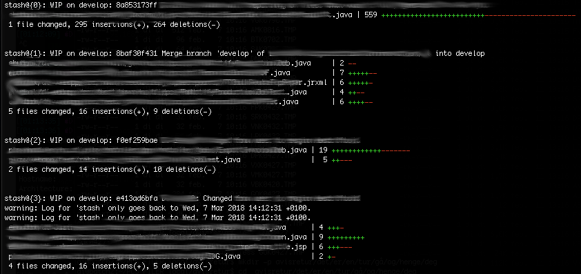

dotfiles
========

>Dotfiles. Fresh and juicy fried dotfiles. Just the way yo moma likes them.
>...well, not only dotfiles, but also other conf-files. 
>Eyecandy gonna make me fat and etch holes in my teeth.

## Aliases

**rstash** - alias for recursive stash list with changelog (name only)

**gtree** - git tree with color formatting

***macsetup.script***
This script is tailored to my needs and preferences as a backend developer working on a Macbook.
It uses osascript aka applascript, and should configure everything I need at the click of a button.
.script files runs in MacOS Script Editor, you'll need to build and run it maually from there. 
The script provides no output as of yet. 

Clone and run at your own risk.

 has provided a possibly  for reference if you want to edit your _com.apple.symbolichotkeys.plist_
